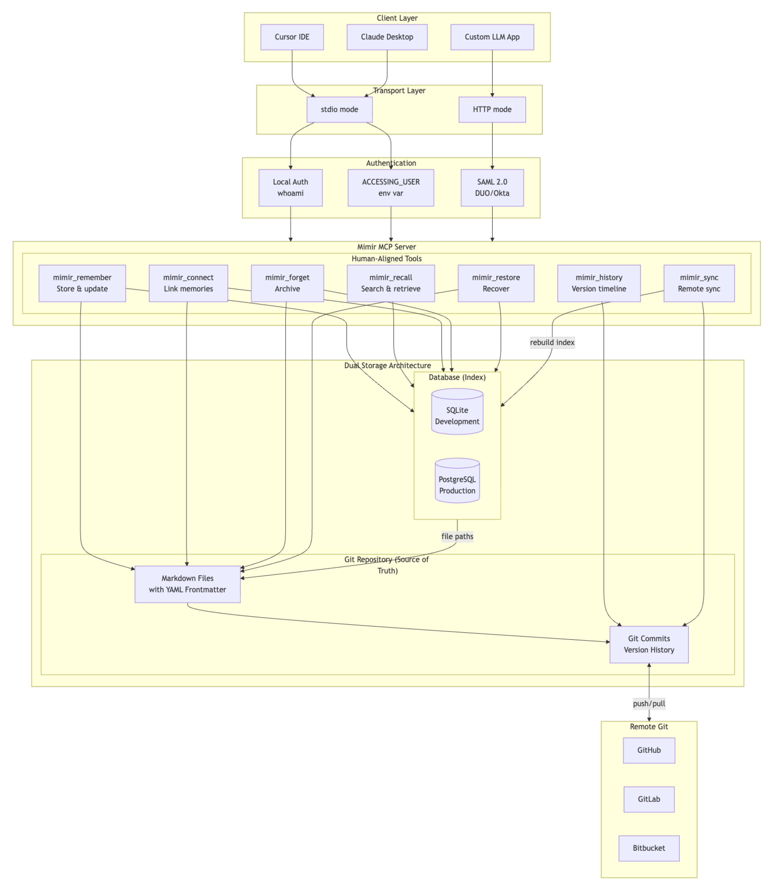

<p align="center">
  
</p>

<h1 align="center">Medha MCP</h1>

<p align="center">
  <a href="https://go.dev/"></a>
  <a href="https://opensource.org/licenses/MPL-2.0"></a>
  <a href="https://modelcontextprotocol.io/"></a>
  <a href="https://hub.docker.com/r/tejzpr/medha-mcp"></a>
</p>

<p align="center"><strong>Git-backed AI Memory System</strong></p>

Medha is a Model Context Protocol (MCP) server that provides persistent, git-versioned memory storage for LLM applications. It combines the power of Git's version control with graph-based memory associations, enabling LLMs to maintain long-term memory.

## Features

- **🔐 Flexible Authentication**: Local mode (development) or SAML 2.0 (production with DUO/Okta)
- **📝 Git-Backed Storage**: Every memory change is a git commit with full history
- **🕸️ Graph Associations**: Link memories with typed relationships
- **🔍 Powerful Search**: Search by tags, dates, content, and associations
- **🧠 Semantic Search**: Optional AI-powered vector search with OpenAI embeddings
- **📊 Knowledge Graphs**: Traverse memory associations with N-hop queries
- **🔄 Auto-Sync**: Hourly synchronization to GitHub with PAT authentication
- **💾 Dual Storage**: Git repository (primary) + per-user SQL database (index)
- **🗑️ Soft Delete**: Archive memories while preserving complete history
- **🏢 Multi-Database**: SQLite for development / local, PostgreSQL for system database
- **🔒 Optimistic Locking**: Safe concurrent access from multiple AI agents

## Architecture

<p align="center">
  
</p>

## Requirements

- **Go 1.24+** - For building from source
- **Git 2.x+** - Required for version-controlled memory storage (git must be in your PATH)
- **GCC/Build Tools** - Required for CGO (sqlite-vec vector search)
  - macOS: `xcode-select --install`
  - Linux: `sudo apt install build-essential`
  - Windows: Use Docker (recommended) or MinGW

## Quick Start

### 1. Build

```bash
make setup    # Run initial setup
make deps     # Install dependencies
make build    # Build the binary
```

### 2. MCP Client Integration

#### Option 1: Native Binary

Add to your MCP client config:

**Cursor** (`~/.cursor/mcp_settings.json`):
```json
{
  "mcpServers": {
    "medha": {
      "command": "/path/to/bin/medha",
      "env": {
        "ENCRYPTION_KEY": "your-32-char-encryption-key-here"
      }
    }
  }
}
```

**Claude Desktop** (`~/Library/Application Support/Claude/claude_desktop_config.json`):
```json
{
  "mcpServers": {
    "medha": {
      "command": "/path/to/bin/medha",
      "args": [],
      "env": {
        "ENCRYPTION_KEY": "your-32-char-encryption-key-here"
      }
    }
  }
}
```

#### Option 2: Go Run

Run Medha directly using `go run` without installing - similar to `uvx` for Python or `npx` for Node.js.

**Prerequisites:** Install Go 1.24+ [go.dev/dl](https://go.dev/dl/) and Git in your PATH:

```bash
# macOS (Homebrew)
brew install go git

# Ubuntu/Debian
sudo apt update && sudo apt install golang-go git

# Windows (Chocolatey)
choco install golang git
```

**MCP Client Config:**

```json
{
  "mcpServers": {
    "medha": {
      "command": "go",
      "args": ["run", "github.com/tejzpr/medha-mcp/cmd/server@latest"],
      "env": {
        "ENCRYPTION_KEY": "your-32-char-encryption-key-here"
      }
    }
  }
}
```

#### Option 3: Docker Container

Configure your MCP client to use the Docker Hub image (no build required).

**Simple mode (single user):**

Uses `whoami` inside container, which returns `medha`. All memories are stored under the `medha` user.

```json
{
  "mcpServers": {
    "medha": {
      "command": "docker",
      "args": [
        "run", "-i", "--rm",
        "-v", "/Users/yourname/.medha:/home/medha/.medha",
        "-e", "ENCRYPTION_KEY=your-32-char-encryption-key-here",
        "tejzpr/medha-mcp"
      ]
    }
  }
}
```

**Multi-user mode (with `--with-accessinguser`):**

Uses `ACCESSING_USER` env var for user identity. Useful when multiple users share the same Medha instance or when integrating with authenticated systems.

```json
{
  "mcpServers": {
    "medha": {
      "command": "docker",
      "args": [
        "run", "-i", "--rm",
        "-v", "/Users/yourname/.medha:/home/medha/.medha",
        "-e", "ENCRYPTION_KEY=your-32-char-encryption-key-here",
        "-e", "ACCESSING_USER=yourname",
        "tejzpr/medha-mcp",
        "--with-accessinguser"
      ]
    }
  }
}
```

> **Important:**
> - Replace `/Users/yourname` with your actual home directory path (e.g., `/Users/john` on macOS, `/home/john` on Linux)
> - Replace `yourname` in `ACCESSING_USER` with your actual username
> - MCP clients do not expand `$HOME` or `~` in JSON configs - use absolute paths
> - The `.medha` mount persists your database and git repositories
> - The container runs as user `medha` (uid 1000), data is stored at `/home/medha/.medha`

**Build locally (optional):**

```bash
docker build -t medha-mcp .
```

Then use `medha-mcp` instead of `tejzpr/medha-mcp` in your config.

**Required mounts:**

| Mount | Purpose |
|-------|---------|
| `/Users/yourname/.medha:/home/medha/.medha` | Persists database, config, and git repositories |

**Environment variables:**

| Variable | Purpose |
|----------|---------|
| `ENCRYPTION_KEY` | 32-character key for encrypting PAT tokens |
| `ACCESSING_USER` | Username for memory isolation (only with `--with-accessinguser`) |

**Flags explained:**
- `-i` = Interactive mode (required for stdio transport)
- `--rm` = Remove container when done
- `--with-accessinguser` = Use `ACCESSING_USER` env var instead of `whoami` for user identity

### 3. Run Modes

**stdio mode (default)**: For MCP client integration
```bash
./bin/medha                      # Uses system user (whoami)
./bin/medha --with-accessinguser # Uses ACCESSING_USER env var
```
- Communicates via stdin/stdout
- Automatically authenticates user
- No web interface needed

**HTTP mode**: For web interface
```bash
./bin/medha --http              # Default port 8080
./bin/medha --http --port=9000  # Custom port
```
- Provides web authentication at `http://localhost:8080/auth`
- Supports SAML 2.0 for enterprise SSO

### 4. Configuration (Optional)

Edit `~/.medha/configs/config.json` for advanced settings:

```json
{
  "auth": {
    "type": "local"
  },
  "server": {
    "host": "localhost",
    "port": 8080
  },
  "database": {
    "type": "sqlite",
    "sqlite_path": "~/.medha/db/medha.db"
  },
  "git": {
    "sync_interval_minutes": 60
  },
  "security": {
    "token_ttl_hours": 24
  },
  "embeddings": {
    "enabled": false,
    "provider": "openai",
    "model": "text-embedding-3-small",
    "api_key_env": "OPENAI_API_KEY",
    "dimensions": 1536
  }
}
```

See [Configuration Guide](docs/configuration.md) for all options including SAML setup.

### 5. Enable Semantic Search (Optional)

For AI-powered semantic search, enable embeddings:

```bash
# Via command line
./bin/medha --enable-embeddings

# Or set in config.json
"embeddings": { "enabled": true }
```

**Requirements:**
- Set `OPENAI_API_KEY` environment variable
- Or configure a compatible embedding API endpoint

**Docker with embeddings:**
```json
{
  "mcpServers": {
    "medha": {
      "command": "docker",
      "args": [
        "run", "-i", "--rm",
        "-v", "/Users/yourname/.medha:/home/medha/.medha",
        "-e", "ENCRYPTION_KEY=your-32-char-key",
        "-e", "OPENAI_API_KEY=sk-your-key",
        "-e", "MEDHA_EMBEDDINGS_ENABLED=true",
        "tejzpr/medha-mcp"
      ]
    }
  }
}
```

## MCP Tools

Medha uses **human-aligned tools** that express intent rather than implementation. This makes them easier for LLMs to use correctly.

### medha_recall
**"What do I know about X?"** - Find and retrieve information:
```json
{
  "topic": "authentication approach",
  "limit": 10
}
```

Also supports `list_all: true` for browsing and `exact: "text"` for literal search.

### medha_remember
**"Store this for later"** - Create or update memories:
```json
{
  "title": "Project Alpha Kickoff",
  "content": "# Meeting Notes\n\nDiscussed project timeline...",
  "tags": ["project", "meeting"],
  "replaces": "old-meeting-notes"
}
```

Use `replaces` to supersede old information (marks it as outdated).

### medha_history
**"When did I learn about X?"** - Temporal queries:
```json
{
  "slug": "project-alpha",
  "show_changes": true,
  "since": "7d"
}
```

### medha_connect
**"These are related"** - Link or unlink memories:
```json
{
  "from": "project-alpha",
  "to": "contact-john-doe",
  "relationship": "person"
}
```

### medha_forget
**"No longer relevant"** - Archive a memory:
```json
{
  "slug": "old-decision"
}
```

### medha_restore
**"Bring back that archived memory"** - Undelete:
```json
{
  "slug": "old-decision"
}
```

### medha_sync
Manual sync to GitHub:
```json
{
  "force": false
}
```

## Memory Format

Memories are stored as Markdown files with YAML frontmatter:

```markdown
---
id: project-alpha-kickoff-2024-01-15
title: "Project Alpha Kickoff Meeting"
tags: [project, meeting]
created: 2024-01-15T10:30:00Z
updated: 2024-01-15T14:00:00Z
associations:
  - target: contact-john-doe
    type: person
    strength: 1.0
---

# Project Alpha Kickoff Meeting

## Attendees
- John Doe (Project Lead)

## Key Decisions
...
```

## Directory Structure

```
~/.medha/
├── configs/
│   └── config.json              # User configuration
├── db/
│   └── medha.db                 # System database (users, auth, repos)
└── store/
    └── medha-{username}/        # User's git repository
        ├── .medha/
        │   └── medha.db         # Per-user database (memories index)
        ├── 2024/
        │   └── 01/              # Date-organized memories
        ├── tags/
        │   └── meetings/        # Tag-based organization
        └── archive/             # Soft-deleted memories
```

**Database Architecture (v2):**
- **System DB** (`~/.medha/db/medha.db`): Users, authentication, repository registry
- **Per-User DB** (`store/medha-{user}/.medha/medha.db`): Memory index, associations, tags (git-tracked)

## Development

> **Note:** CGO is required for sqlite-vec. Ensure GCC is installed.

```bash
# Build
make build              # Build binary (CGO enabled)
make build-native       # Build optimized for current platform

# Run tests
make test               # Run unit tests
make test-integration   # Run integration tests
make test-functional    # Run functional tests
make test-all           # Run all tests

# Run server
make run                # stdio mode (MCP)
make run-http           # HTTP server mode
make run-with-embeddings # With semantic search

# Code quality
make lint               # Run linter
make vet                # Run go vet
make coverage           # View test coverage

# Docker
make docker-build       # Build Docker image
make docker-run         # Run container
make docker-run-with-embeddings # With embeddings
```

## Database Rebuild

If you need to rebuild the database index from your git repository:

```bash
# Rebuild system database from git
medha --rebuilddb

# Rebuild and overwrite existing data
medha --rebuilddb --force

# Rebuild per-user database (v2)
medha --rebuild-userdb all           # All users
medha --rebuild-userdb username      # Specific user
medha --rebuild-userdb /path/to/repo # By path
medha --rebuild-userdb all --force   # Force overwrite
```

## Contributing

Contributions are welcome! Please ensure:
- All tests pass (`make test`)
- Code is properly formatted (`go fmt`)
- Linter passes (`make lint`)
- Documentation is updated

## License

This project is licensed under the [Mozilla Public License 2.0](LICENSE).


